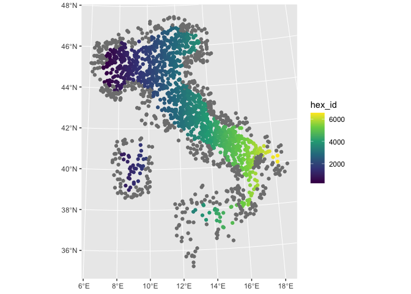

Make a grid and intersect points with the sf package
================
Francesco Bailo (<francesco.bailo@sydney.edu.au>)

## Package for spatial analysis

``` r
library(sf) 
```

    ## Linking to GEOS 3.11.0, GDAL 3.5.3, PROJ 9.1.0; sf_use_s2() is TRUE

Package’s
documentation:<https://cran.r-project.org/web/packages/sf/index.html>

## Other packages

``` r
library(tidyverse)
```

    ## ── Attaching packages ─────────────────────────────────────── tidyverse 1.3.2 ──
    ## ✔ ggplot2 3.4.0      ✔ purrr   1.0.1 
    ## ✔ tibble  3.2.0      ✔ dplyr   1.0.10
    ## ✔ tidyr   1.2.1      ✔ stringr 1.5.0 
    ## ✔ readr   2.1.3      ✔ forcats 0.5.2 
    ## ── Conflicts ────────────────────────────────────────── tidyverse_conflicts() ──
    ## ✖ dplyr::filter() masks stats::filter()
    ## ✖ dplyr::lag()    masks stats::lag()

## Read/Inspect shapefile

``` r
regions.sf <- 
  sf::read_sf("data/Reg01012020_g_WGS84.shp")
```

``` r
st_crs(regions.sf)
```

    ## Coordinate Reference System:
    ##   User input: WGS 84 / UTM zone 32N 
    ##   wkt:
    ## PROJCRS["WGS 84 / UTM zone 32N",
    ##     BASEGEOGCRS["WGS 84",
    ##         DATUM["World Geodetic System 1984",
    ##             ELLIPSOID["WGS 84",6378137,298.257223563,
    ##                 LENGTHUNIT["metre",1]]],
    ##         PRIMEM["Greenwich",0,
    ##             ANGLEUNIT["degree",0.0174532925199433]],
    ##         ID["EPSG",4326]],
    ##     CONVERSION["UTM zone 32N",
    ##         METHOD["Transverse Mercator",
    ##             ID["EPSG",9807]],
    ##         PARAMETER["Latitude of natural origin",0,
    ##             ANGLEUNIT["Degree",0.0174532925199433],
    ##             ID["EPSG",8801]],
    ##         PARAMETER["Longitude of natural origin",9,
    ##             ANGLEUNIT["Degree",0.0174532925199433],
    ##             ID["EPSG",8802]],
    ##         PARAMETER["Scale factor at natural origin",0.9996,
    ##             SCALEUNIT["unity",1],
    ##             ID["EPSG",8805]],
    ##         PARAMETER["False easting",500000,
    ##             LENGTHUNIT["metre",1],
    ##             ID["EPSG",8806]],
    ##         PARAMETER["False northing",0,
    ##             LENGTHUNIT["metre",1],
    ##             ID["EPSG",8807]]],
    ##     CS[Cartesian,2],
    ##         AXIS["(E)",east,
    ##             ORDER[1],
    ##             LENGTHUNIT["metre",1]],
    ##         AXIS["(N)",north,
    ##             ORDER[2],
    ##             LENGTHUNIT["metre",1]],
    ##     ID["EPSG",32632]]

The coordinate reference system is important as it defines the unit
(e.g. meters or degrees) for the grid size. In this case the CRS is
`WGS 84 / UTM zone 32N` or `ID["EPSG",32632]]` which is in meters (see
<https://epsg.io/32632>).

``` r
regions.sf %>%
  ggplot2::ggplot() +
  ggplot2::geom_sf()
```

<!-- -->

# Union

You want a mask to your grid, so if you gave multiple features (here 20
regions) you might want to combine them (resolving the internal
boundaries). With sf and dplyr this can achieved with:

``` r
regions.sf$unit <- 
  1

italy.sf <- 
  regions.sf %>%
  dplyr::group_by(unit) %>%
  dplyr::summarize(AREA = sum(SHAPE_AREA))
```

``` r
italy.sf %>%
  ggplot2::ggplot() +
  ggplot2::geom_sf()
```

<!-- -->

## Making the grid

This is a two step process.

1.  With `st_make_grid` we create the grid as simple feature object.
    `cellsize` is in the unit of the mask feature (here `italy.sf` is in
    meters). `square = FALSE` creates an hexagonal grid instead of a
    square grid.

2.  With `st_sf` we append to the simple feature object a data frame -
    for future data analysis.

``` r
italy_hex.sf <-
  sf::st_make_grid(italy.sf,
                   cellsize = 15000,
                   what = "polygons",
                   square = FALSE)
```

``` r
italy_hex.sf <-
  sf::st_sf(hex_id = 1:length(lengths(italy_hex.sf)),
            italy_hex.sf)
```

``` r
italy_hex.sf %>%
  ggplot2::ggplot() +
  ggplot2::geom_sf()
```

<!-- -->

## Cropping

Finally we crop the grid

``` r
italy_hex_cropped.sf <-
  sf::st_intersection(italy_hex.sf, 
                  italy.sf %>% st_make_valid())
```

    ## Warning: attribute variables are assumed to be spatially constant throughout
    ## all geometries

``` r
italy_hex_cropped.sf %>%
  ggplot2::ggplot() +
  ggplot2::geom_sf()
```

<!-- -->

## Intersecting with points

Let’s generate a buch of random points within the feature of
`regions.sf`. Note: we use `st_buffer` so that some points is going to
lay outside of the area we want to interst.

``` r
random_pnt.sf <- 
  sf::st_sample(sf::st_buffer(regions.sf, 50000), 
                size = rep(100, nrow(regions.sf)))
```

Our points are in the same CRS of all the other simple features (by
design). If this is not the case, you must convert now to a common CRS
with

``` r
random_pnt.sf <- 
  sf::st_transform(random_pnt.sf, 32632)
```

and add a data frame to it

``` r
random_pnt.sf <-
  sf::st_sf(pnt_id = 1:length(lengths(random_pnt.sf)),
            random_pnt.sf)
```

``` r
random_pnt.sf %>%
  ggplot2::ggplot() +
  ggplot2::geom_sf() +
   ggplot2::geom_sf(data = italy_hex_cropped.sf, fill = NA, alpha = .2)
```

<!-- -->

``` r
point_intersection.list <-
  sf::st_intersects(random_pnt.sf,
                    italy_hex_cropped.sf)
```

``` r
point_intersection.list
```

    ## Sparse geometry binary predicate list of length 2000, where the
    ## predicate was `intersects'
    ## first 10 elements:
    ##  1: 118
    ##  2: 59
    ##  3: (empty)
    ##  4: 76
    ##  5: 192
    ##  6: (empty)
    ##  7: (empty)
    ##  8: 282
    ##  9: 97
    ##  10: 415

Let’s make sure we don’t lose any point in the conversion from list to
vector in case they are out of the intersecting area (here the area of
`italy_hex_cropped.sf`). If they are, `st_intersects` intersect will
return a vector of length 0 instead of the index of the intersecting
feature. Vectors of length 0 in are lost like tears in the rain when we
`unlist()`.

``` r
point_intersection.list[sapply(point_intersection.list, FUN = function(x) length(x) == 0)] <- NA
```

``` r
point_intersection.list
```

    ## Sparse geometry binary predicate list of length 2000, where the
    ## predicate was `intersects'
    ## first 10 elements:
    ##  1: 118
    ##  2: 59
    ##  3: NA
    ##  4: 76
    ##  5: 192
    ##  6: NA
    ##  7: NA
    ##  8: 282
    ##  9: 97
    ##  10: 415

Then we can add the resulting `italy_hex_cropped.sf$hex_id` to
`random_pnt.sf`.

``` r
random_pnt.sf$hex_id <- 
  italy_hex_cropped.sf$hex_id[unlist(point_intersection.list)]
```

``` r
head(random_pnt.sf)
```

    ## Simple feature collection with 6 features and 2 fields
    ## Geometry type: POINT
    ## Dimension:     XY
    ## Bounding box:  xmin: 303389.3 ymin: 4930125 xmax: 451187.8 ymax: 5163356
    ## Projected CRS: WGS 84 / UTM zone 32N
    ##   pnt_id            random_pnt.sf hex_id
    ## 1      1 POINT (429070.5 4931973)    839
    ## 2      2   POINT (373757 5013787)    542
    ## 3      3 POINT (303389.3 4980196)     NA
    ## 4      4 POINT (388447.9 4930125)    639
    ## 5      5 POINT (451187.8 4989163)   1041
    ## 6      6 POINT (418223.4 5163356)     NA

``` r
random_pnt.sf %>%
  ggplot2::ggplot() +
  ggplot2::geom_sf(aes(colour = hex_id)) +
  scale_colour_viridis_c()
```

<!-- -->

As we can see, `hex_id` is assigned from North West to South East.
